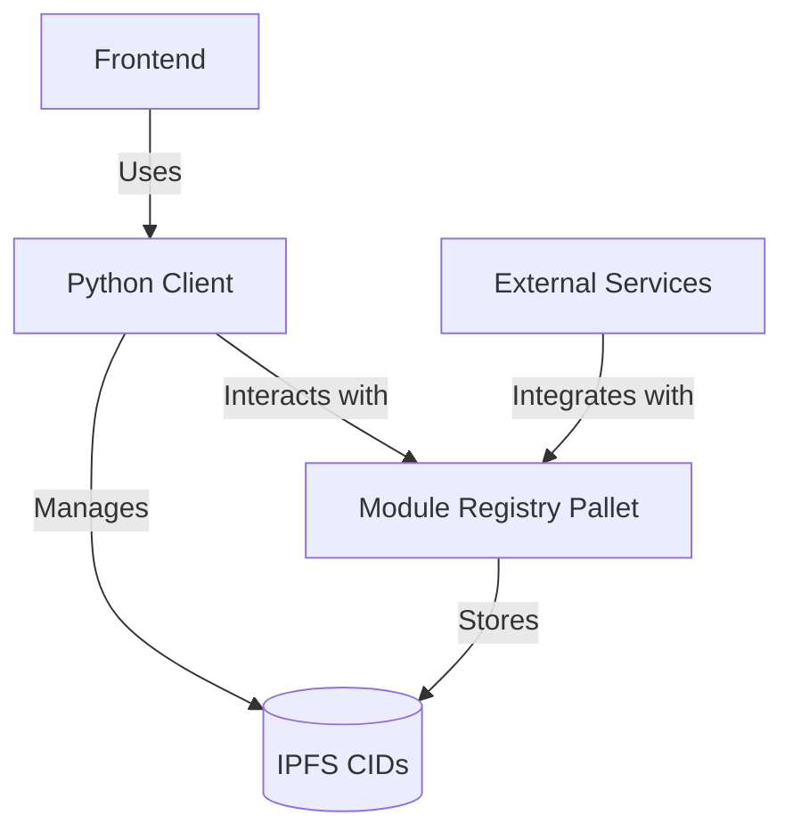

# Mod-Net Module Registry

[](LICENSE)
[](https://github.com/Bakobiibizo/mod-net-modules/actions)
[](https://codecov.io/gh/Bakobiibizo/mod-net-modules)
[](https://bakobiibizo.github.io/mod-net-modules/)

A production-grade decentralized module registry built on [Substrate](https://substrate.io/) with IPFS integration for secure, distributed metadata storage.

## 🌟 Features

- **Multi-chain Module Registry**: Manage modules across different blockchain networks
- **IPFS-Powered Storage**: Decentralized metadata storage using IPFS
- **Type-safe Python Client**: Easy integration with existing Python projects
- **Production-Ready**: Comprehensive CI/CD, testing, and documentation
- **Modular Architecture**: Extensible design for custom implementations

## 🏗️ Architecture



### Core Components

1. **Module Registry Pallet**
   - On-chain storage for module metadata references
   - Multi-chain public key support
   - Efficient storage using IPFS CIDs

2. **IPFS Integration**
   - Distributed metadata storage
   - Content-addressable architecture
   - Off-chain data availability

3. **Python Client**
   - Type-safe API client
   - Asynchronous operations
   - Comprehensive error handling

## Prerequisites

- Rust (latest stable, install via [rustup](https://rustup.rs/))
- Python 3.10+
- IPFS daemon ([installation guide](https://docs.ipfs.tech/install/))
- Substrate dependencies:
  ```bash
  curl https://getsubstrate.io -sSf | bash -s -- --fast
  ```

### Quick Start

1. **Clone the repository**
   ```bash
   git clone --recursive https://github.com/Bakobiibizo/mod-net-modules.git
   cd mod-net-modules/modules
   ```

2. **Build the node**
   ```bash
   cargo build --release
   ```

3. **Set up Python environment**
   ```bash
   # Using standard venv
   python -m venv .venv
   source .venv/bin/activate  # On Windows: .venv\Scripts\activate

   # Install development dependencies
   pip install -r requirements-dev.txt

   # Alternative: Using uv (faster)
   # pip install uv
   # uv venv
   # source .venv/bin/activate
   # uv pip install -r requirements-dev.txt
   ```

4. **Start IPFS daemon**
   ```bash
   ipfs daemon
   ```

5. **Run the node**
   ```bash
   ./target/release/node-template --dev
   ```

## 📚 Documentation

- [Architecture](./docs/ARCHITECTURE.md) - High-level system design
- [API Reference](./docs/API.md) - Detailed API documentation
- [Development Guide](./docs/DEVELOPMENT.md) - Setting up a development environment
- [Deployment Guide](./docs/DEPLOYMENT.md) - Production deployment instructions

## 🤝 Contributing

We welcome contributions! Please see our [Contributing Guide](./CONTRIBUTING.md) for details.

1. Fork the repository
2. Create your feature branch (`git checkout -b feature/AmazingFeature`)
3. Commit your changes (`git commit -m 'Add some AmazingFeature'`)
4. Push to the branch (`git push origin feature/AmazingFeature`)
5. Open a Pull Request

## 📜 License

This project is licensed under the MIT-0 License - see the [LICENSE](LICENSE) file for details.

## 📬 Contact

Project Link: [https://github.com/Bakobiibizo/mod-net-modules](https://github.com/Bakobiibizo/mod-net-modules)

## 🙏 Acknowledgments

- Built on [Substrate](https://substrate.io/)
- Uses [IPFS](https://ipfs.io/) for distributed storage
- Inspired by the [Substrate Node Template](https://github.com/substrate-developer-hub/substrate-node-template/)

## Getting Started

### Prerequisites

- Rust and Substrate dependencies ([installation guide](https://docs.substrate.io/install/))
- Python 3.10 or higher
- UV package manager (`pip install uv`)
- IPFS daemon ([installation guide](https://docs.ipfs.tech/install/))

### Development Environment

1. **Clone and Build**
   ```sh
   git clone --recursive https://github.com/your-org/mod-net.git
   cd mod-net/modules
   cargo build --release
   ```

2. **Python Environment Setup**
   ```sh
   uv venv
   source .venv/bin/activate
   uv pip install -r requirements.txt
   ```

3. **IPFS Setup**
   ```sh
   # Start IPFS daemon
   ipfs daemon
   # Default endpoints:
   # - API: http://localhost:5001
   # - Gateway: http://localhost:8080
   ```

Fetch solochain template code:

```sh
git clone https://github.com/paritytech/polkadot-sdk-solochain-template.git solochain-template

cd solochain-template
```

## Development Workflow

### Quality Standards

- No TODOs, placeholders, or mock implementations
- All code must be production-ready with thorough testing
- Type hints and documentation required for all code
- Strict adherence to code formatting and linting rules

### Git Workflow

1. **Branch Naming**
   - Features: `feature/descriptive-name`
   - Fixes: `fix/issue-description`
   - Documentation: `docs/topic-name`

2. **Commit Messages**
   Follow the [Conventional Commits](https://www.conventionalcommits.org/) standard:
   ```
   type(scope): description

   [optional body]
   [optional footer]
   ```

### Testing

1. **Rust Tests**
   ```sh
   # Run all Rust tests
   cargo test --all
   # Run specific pallet tests
   cargo test -p pallet-module-registry
   ```

2. **Python Tests**
   ```sh
   # Run Python tests with coverage
   pytest tests/ --cov=modnet
   ```

3. **Integration Tests**
   ```sh
   # Ensure IPFS daemon is running
   ./scripts/run-integration-tests.sh
   ```

### Code Quality

1. **Rust**
   ```sh
   # Format code
   cargo fmt --all
   # Run clippy
   cargo clippy --all-targets --all-features
   ```

2. **Python**
   ```sh
   # Format code
   black modnet tests
   isort modnet tests
   # Run linters
   ruff check modnet tests
   mypy modnet tests
   ```

### Documentation

After you build the project, you can use the following command to explore its
parameters and subcommands:

```sh
./target/release/solochain-template-node -h
```

You can generate and view the [Rust
Docs](https://doc.rust-lang.org/cargo/commands/cargo-doc.html) for this template
with this command:

```sh
cargo +nightly doc --open
```

### Single-Node Development Chain

The following command starts a single-node development chain that doesn't
persist state:

```sh
./target/release/solochain-template-node --dev
```

To purge the development chain's state, run the following command:

```sh
./target/release/solochain-template-node purge-chain --dev
```

To start the development chain with detailed logging, run the following command:

```sh
RUST_BACKTRACE=1 ./target/release/solochain-template-node -ldebug --dev
```

Development chains:

- Maintain state in a `tmp` folder while the node is running.
- Use the **Alice** and **Bob** accounts as default validator authorities.
- Use the **Alice** account as the default `sudo` account.
- Are preconfigured with a genesis state (`/node/src/chain_spec.rs`) that
  includes several pre-funded development accounts.


To persist chain state between runs, specify a base path by running a command
similar to the following:

```sh
// Create a folder to use as the db base path
$ mkdir my-chain-state

// Use of that folder to store the chain state
$ ./target/release/solochain-template-node --dev --base-path ./my-chain-state/

// Check the folder structure created inside the base path after running the chain
$ ls ./my-chain-state
chains
$ ls ./my-chain-state/chains/
dev
$ ls ./my-chain-state/chains/dev
db keystore network
```

### Connect with Polkadot-JS Apps Front-End

After you start the node template locally, you can interact with it using the
hosted version of the [Polkadot/Substrate
Portal](https://polkadot.js.org/apps/#/explorer?rpc=ws://localhost:9944)
front-end by connecting to the local node endpoint. A hosted version is also
available on [IPFS](https://dotapps.io/). You can
also find the source code and instructions for hosting your own instance in the
[`polkadot-js/apps`](https://github.com/polkadot-js/apps) repository.

### Multi-Node Local Testnet

If you want to see the multi-node consensus algorithm in action, see [Simulate a
network](https://docs.substrate.io/tutorials/build-a-blockchain/simulate-network/).

## Project Architecture

The Mod-Net module registry consists of several key components:

### Module Registry Pallet

The core Substrate pallet (`pallet-module-registry`) provides:
- On-chain module registration and verification
- Module metadata management with IPFS integration
- Version control and dependency tracking
- Access control and permissions

### IPFS Integration

The `commune-ipfs` submodule provides:
- Distributed storage for module metadata
- FastAPI backend for IPFS interaction
- Redundant storage and content addressing
- Default endpoints:
  - API: http://localhost:5001
  - Gateway: http://localhost:8080

### Python Client

The `modnet` package provides:
- Type-safe interface to the module registry
- IPFS metadata management
- Substrate RPC interaction
- Comprehensive test suite

### Node

A blockchain node is an application that allows users to participate in a
blockchain network. Substrate-based blockchain nodes expose a number of
capabilities:

- Networking: Substrate nodes use the [`libp2p`](https://libp2p.io/) networking
  stack to allow the nodes in the network to communicate with one another.
- Consensus: Blockchains must have a way to come to
  [consensus](https://docs.substrate.io/fundamentals/consensus/) on the state of
  the network. Substrate makes it possible to supply custom consensus engines
  and also ships with several consensus mechanisms that have been built on top
  of [Web3 Foundation
  research](https://research.web3.foundation/Polkadot/protocols/NPoS).
- RPC Server: A remote procedure call (RPC) server is used to interact with
  Substrate nodes.

There are several files in the `node` directory. Take special note of the
following:

- [`chain_spec.rs`](./node/src/chain_spec.rs): A [chain
  specification](https://docs.substrate.io/build/chain-spec/) is a source code
  file that defines a Substrate chain's initial (genesis) state. Chain
  specifications are useful for development and testing, and critical when
  architecting the launch of a production chain. Take note of the
  `development_config` and `testnet_genesis` functions. These functions are
  used to define the genesis state for the local development chain
  configuration. These functions identify some [well-known
  accounts](https://docs.substrate.io/reference/command-line-tools/subkey/) and
  use them to configure the blockchain's initial state.
- [`service.rs`](./node/src/service.rs): This file defines the node
  implementation. Take note of the libraries that this file imports and the
  names of the functions it invokes. In particular, there are references to
  consensus-related topics, such as the [block finalization and
  forks](https://docs.substrate.io/fundamentals/consensus/#finalization-and-forks)
  and other [consensus
  mechanisms](https://docs.substrate.io/fundamentals/consensus/#default-consensus-models)
  such as Aura for block authoring and GRANDPA for finality.


### Runtime

The Mod-Net runtime extends the Substrate runtime with our custom module registry pallet. Key features include:
- Module registration and verification logic
- IPFS CID storage and validation
- Access control and permissions management
- Version control and dependency resolution The Substrate
project in this repository uses
[FRAME](https://docs.substrate.io/learn/runtime-development/#frame) to construct
a blockchain runtime. FRAME allows runtime developers to declare domain-specific
logic in modules called "pallets". At the heart of FRAME is a helpful [macro
language](https://docs.substrate.io/reference/frame-macros/) that makes it easy
to create pallets and flexibly compose them to create blockchains that can
address [a variety of needs](https://substrate.io/ecosystem/projects/).

Review the [FRAME runtime implementation](./runtime/src/lib.rs) included in this
template and note the following:

- This file configures several pallets to include in the runtime. Each pallet
  configuration is defined by a code block that begins with `impl
  $PALLET_NAME::Config for Runtime`.
- The pallets are composed into a single runtime by way of the
  [#[runtime]](https://paritytech.github.io/polkadot-sdk/master/frame_support/attr.runtime.html)
  macro, which is part of the [core FRAME pallet
  library](https://docs.substrate.io/reference/frame-pallets/#system-pallets).

### CI/CD Pipeline

Comprehensive GitHub Actions workflows ensure code quality:

1. **Rust CI (`rust.yml`)**
   - Cargo check and build
   - Clippy linting
   - Documentation generation
   - Unit and integration tests

2. **Python CI (`python.yml`)**
   - Black and isort formatting
   - Ruff and mypy linting
   - Unit tests with coverage
   - Type checking

3. **Integration Tests (`integration.yml`)**
   - IPFS service container
   - Combined Rust/Python testing
   - End-to-end workflow validation

A FRAME pallet is comprised of a number of blockchain primitives, including:

- Storage: FRAME defines a rich set of powerful [storage
  abstractions](https://docs.substrate.io/build/runtime-storage/) that makes it
  easy to use Substrate's efficient key-value database to manage the evolving
  state of a blockchain.
- Dispatchables: FRAME pallets define special types of functions that can be
  invoked (dispatched) from outside of the runtime in order to update its state.
- Events: Substrate uses
  [events](https://docs.substrate.io/build/events-and-errors/) to notify users
  of significant state changes.
- Errors: When a dispatchable fails, it returns an error.

Each pallet has its own `Config` trait which serves as a configuration interface
to generically define the types and parameters it depends on.

## Alternatives Installations

Instead of installing dependencies and building this source directly, consider
the following alternatives.

### Nix

Install [nix](https://nixos.org/) and
[nix-direnv](https://github.com/nix-community/nix-direnv) for a fully
plug-and-play experience for setting up the development environment. To get all
the correct dependencies, activate direnv `direnv allow`.

### Docker

Please follow the [Substrate Docker instructions
here](https://github.com/paritytech/polkadot-sdk/blob/master/substrate/docker/README.md) to
build the Docker container with the Substrate Node Template binary.
