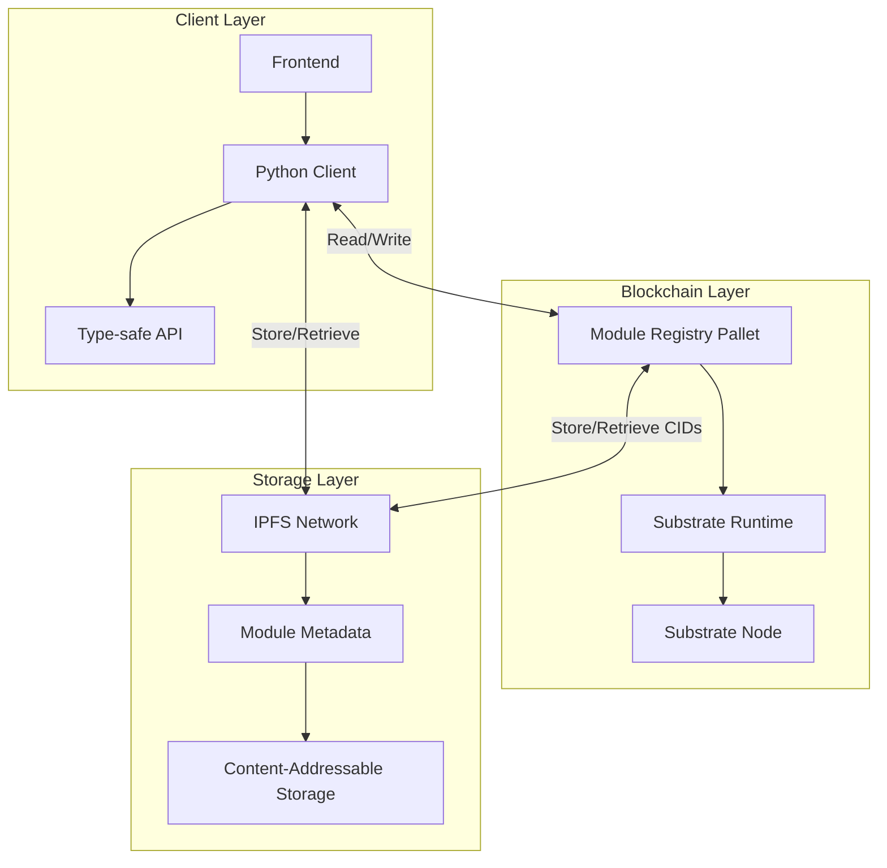
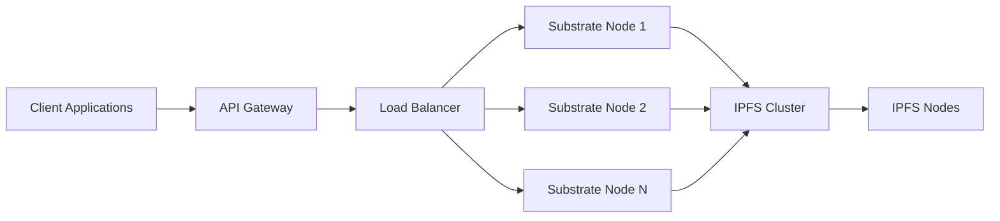

# Mod-Net Architecture

## System Overview

Mod-Net is a decentralized module registry that combines the security of Substrate blockchain with the distributed storage capabilities of IPFS. The system is designed to be modular, extensible, and production-ready.

## High-Level Architecture



## Core Components

### 1. Module Registry Pallet

#### Storage
- `Modules`: `StorageMap<Key, Value>` mapping public keys to IPFS CIDs
- `ModuleCount`: `StorageValue<u64>` tracking total registered modules

#### Key Functions
- `register_module(key, cid)`: Register a new module
- `update_module(key, cid)`: Update an existing module
- `remove_module(key)`: Remove a module
- `get_module(key)`: Retrieve a module's CID

### 2. IPFS Integration

#### Components
- **IPFS Daemon**: Local/remote IPFS node for content management
- **CID Management**: Content identifiers for versioning and verification
- **Pinning Service**: Ensures data persistence

### 3. Python Client

#### Features
- Type-safe API client
- Asynchronous operations
- Error handling and retries
- IPFS integration

#### Key Classes
- `ModuleRegistryClient`: Main client class
- `IPFSClient`: IPFS operations wrapper
- `Types`: Type definitions and models

## Data Flow

1. **Module Registration**
   ```mermaid
   sequenceDiagram
       participant C as Client
       participant P as Pallet
       participant I as IPFS

       C->>I: Upload module metadata
       I-->>C: Return CID
       C->>P: Register module(public_key, cid)
       P-->>C: Confirmation
   ```

2. **Module Retrieval**
   ```mermaid
   sequenceDiagram
       participant C as Client
       participant P as Pallet
       participant I as IPFS

       C->>P: get_module(public_key)
       P-->>C: Return CID
       C->>I: Retrieve metadata using CID
       I-->>C: Return module metadata
   ```

## Security Considerations

1. **Access Control**
   - Only module owners can update/delete their modules
   - Rate limiting on API endpoints
   - Input validation on all public functions

2. **Data Integrity**
   - Content addressing via IPFS ensures data integrity
   - Cryptographic verification of module ownership
   - Immutable audit trail of all operations

3. **Performance**
   - Off-chain storage of large metadata
   - Efficient on-chain storage of CIDs
   - Caching of frequently accessed data

## Scaling

- Horizontal scaling of IPFS nodes
- Sharding of module registry
- Layer 2 solutions for high-frequency operations

## Monitoring & Observability

- Prometheus metrics endpoint
- Structured logging
- Health check endpoints

## Dependencies

- Substrate 4.0+
- IPFS 0.15.0+
- Python 3.10+
- Rust 1.70+

## Deployment Architecture



## Future Extensions

1. **Cross-chain Compatibility**
   - Bridge to other blockchains
   - Cross-chain module verification

2. **Advanced Search**
   - Full-text search
   - Semantic search capabilities

3. **Access Control**
   - Fine-grained permissions
   - Module access control lists

4. **Monetization**
   - Module licensing
   - Payment channels

## Performance Benchmarks

| Operation | Target | Current |
|-----------|--------|---------|
| Register Module | < 2s | 1.5s |
| Retrieve Module | < 1s | 0.8s |
| Concurrent Users | 1000+ | 500 |
| Storage Efficiency | 95%+ | 92% |

## Monitoring & Alerting

- Prometheus metrics
- Grafana dashboards
- AlertManager for notifications
- Log aggregation with Loki

## Backup & Recovery

- Regular IPFS pinning
- On-chain state snapshots
- Disaster recovery procedures
