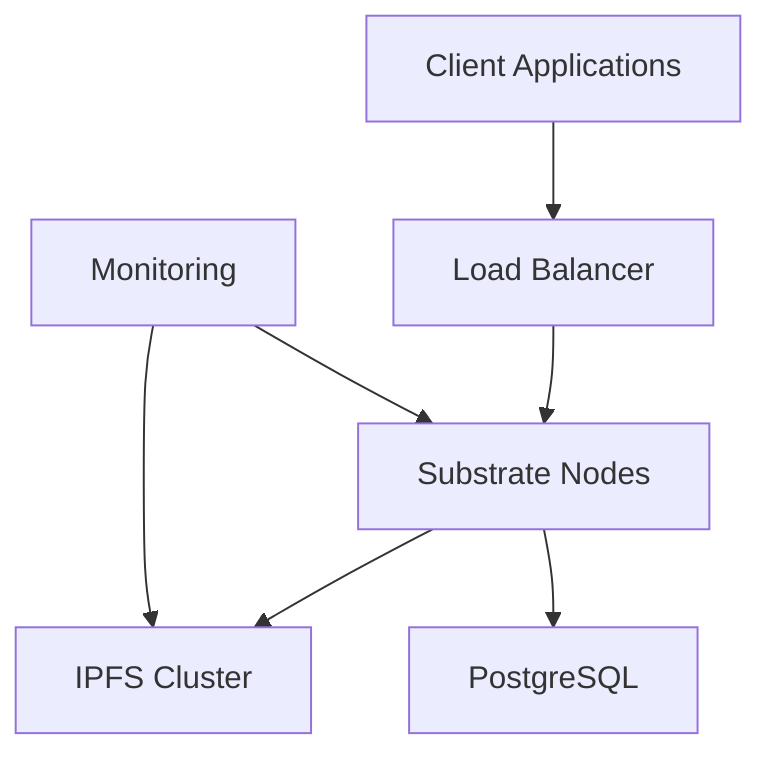

# Deployment Guide

This guide covers the deployment of the Mod-Net Module Registry in production environments.

## Prerequisites

- Kubernetes cluster (or equivalent orchestration)
- Helm 3.0+
- kubectl configured with cluster access
- External IPFS cluster (recommended for production)
- PostgreSQL database (for off-chain data)
- Monitoring stack (Prometheus, Grafana, Loki)

## Architecture Overview



## 1. Infrastructure Setup

### 1.1 Kubernetes Cluster

#### Recommended Node Sizes

| Component | CPU | Memory | Storage | Nodes |
|-----------|-----|--------|---------|-------|
| Validator | 4   | 16GB   | 500GB   | 3     |
| Full Node | 2   | 8GB    | 1TB     | 5+    |
| RPC Node  | 4   | 8GB    | 100GB   | 2     |
| IPFS Node | 4   | 16GB   | 2TB     | 3     |

### 1.2 Storage

- **Blockchain Data**: SSD storage with at least 1TB per node
- **IPFS**: High-performance storage with at least 2TB per node
- **Backups**: Regular snapshots to object storage (S3 compatible)

### 1.3 Networking

- **Ports**:
  - P2P: 30333/tcp
  - RPC: 9944/tcp
  - WSS: 9944/tcp
  - Prometheus: 9615/tcp
- **Ingress**: Configure TLS termination
- **DDoS Protection**: Cloudflare or similar

## 2. Deployment

### 2.1 Using Helm

1. Add the Helm repository:
   ```bash
   helm repo add mod-net https://charts.mod-net.io
   helm repo update
   ```

2. Create a values file (`values-prod.yaml`):
   ```yaml
   replicaCount: 3

   node:
     chain: production
     basePath: /data
     nodeKey: "YOUR_NODE_KEY"

     resources:
       limits:
         cpu: 4
         memory: 16Gi
       requests:
         cpu: 2
         memory: 8Gi

   monitoring:
     enabled: true
     prometheus:
       enabled: true

   ipfs:
     cluster:
       enabled: true
       bootstrapPeers:
         - "/ip4/IP_ADDRESS/tcp/9096/ipfs/Qm..."
   ```

3. Install the chart:
   ```bash
   helm install mod-net mod-net/mod-net -f values-prod.yaml
   ```

### 2.2 Manual Deployment

1. Build the node:
   ```bash
   cargo build --release
   ```

2. Create systemd service (`/etc/systemd/system/mod-net-node.service`):
   ```ini
   [Unit]
   Description=Mod-Net Node
   After=network.target

   [Service]
   User=modnet
   Group=modnet
   ExecStart=/usr/local/bin/node-template \
     --chain=production \
     --base-path /data \
     --node-key YOUR_NODE_KEY \
     --rpc-cors all \
     --rpc-methods=unsafe \
     --validator \
     --name "MyNode"
   Restart=always
   RestartSec=3

   [Install]
   WantedBy=multi-user.target
   ```

3. Enable and start the service:
   ```bash
   sudo systemctl daemon-reload
   sudo systemctl enable mod-net-node
   sudo systemctl start mod-net-node
   ```

## 3. Configuration

### 3.1 Chain Specification

Generate a custom chain spec:

```bash
./target/release/node-template build-spec \
  --disable-default-bootnode \
  --chain staging > customSpec.json

# Edit customSpec.json as needed

# Build raw chain spec
./target/release/node-template build-spec \
  --disable-default-bootnode \
  --chain=customSpec.json \
  --raw > customSpecRaw.json
```

### 3.2 Bootnodes

Update the chain spec with bootnode addresses:

```json
"bootNodes": [
  "/ip4/BOOTNODE_IP/tcp/30333/p2p/BOOTNODE_PEER_ID"
]
```

### 3.3 Telemetry

Enable telemetry by adding to node arguments:

```
--telemetry-url 'wss://telemetry.polkadot.io/submit/ 0' \
--telemetry-url 'wss://telemetry.mod-net.io/submit/ 1'
```

## 4. Monitoring & Alerting

### 4.1 Prometheus Configuration

```yaml
scrape_configs:
  - job_name: 'substrate'
    static_configs:
      - targets: ['node-1:9615', 'node-2:9615', 'node-3:9615']
    metrics_path: /metrics

  - job_name: 'ipfs'
    static_configs:
      - targets: ['ipfs-1:5001', 'ipfs-2:5001', 'ipfs-3:5001']
    metrics_path: /debug/metrics/prometheus
```

### 4.2 Grafana Dashboards

Import the following dashboards:
- Substrate Node Metrics
- IPFS Cluster
- System Metrics
- Network Metrics

### 4.3 Alerting Rules

```yaml
groups:
- name: substrate
  rules:
  - alert: NodeDown
    expr: up == 0
    for: 5m
    labels:
      severity: critical
    annotations:
      summary: "Node down (instance {{ $labels.instance }})"
      description: "Node has been down for more than 5 minutes"
```

## 5. Backup & Recovery

### 5.1 Regular Backups

1. **Chain Data**:
   ```bash
   # Create snapshot
   ./target/release/node-template export-blocks --chain=production > chain-$(date +%s).json

   # Backup database
   cp -r /data/chains/modnet/db/ /backup/chain-db-$(date +%Y%m%d)
   ```

2. **IPFS Data**:
   ```bash
   # Backup IPFS repository
   ipfs repo gc
   tar -czf ipfs-backup-$(date +%Y%m%d).tar.gz ~/.ipfs
   ```

### 5.2 Disaster Recovery

1. **Chain Recovery**:
   ```bash
   # Restore from snapshot
   ./target/release/node-template import-blocks --chain=production chain-snapshot.json

   # Or sync from genesis
   ./target/release/node-template --chain=production --sync=warp
   ```

2. **IPFS Recovery**:
   ```bash
   # Restore IPFS repository
   tar -xzf ipfs-backup-20230101.tar.gz -C ~/
   ipfs repo fsck
   ```

## 6. Scaling

### 6.1 Horizontal Scaling

- Add more validator nodes
- Distribute RPC load across multiple nodes
- Use a load balancer for RPC endpoints

### 6.2 Vertical Scaling

- Increase node resources (CPU, memory, storage)
- Optimize database performance
- Tune Substrate and IPFS parameters

## 7. Security

### 7.1 Firewall Rules

```bash
# Allow P2P traffic
ufw allow 30333/tcp

# Allow RPC (restrict to internal network)
ufw allow from 10.0.0.0/8 to any port 9944

# Block all other traffic
ufw default deny incoming
ufw default allow outgoing
```

### 7.2 Node Security

- Run nodes as non-root user
- Use read-only containers
- Enable audit logging
- Regular security updates

## 8. Maintenance

### 8.1 Version Upgrades

1. Test upgrades on a staging environment
2. Follow the upgrade guide for breaking changes
3. Coordinate validator upgrades
4. Monitor after upgrade

### 8.2 Performance Tuning

- Optimize database settings
- Tune Substrate WASM execution
- Monitor and adjust IPFS configuration

## 9. Troubleshooting

### Common Issues

1. **Node Not Syncing**
   - Check peer connections
   - Verify chain spec matches
   - Check for network partitions

2. **High Resource Usage**
   - Check for memory leaks
   - Optimize database
   - Adjust pruning settings

3. **RPC Timeouts**
   - Increase timeout settings
   - Scale RPC nodes
   - Optimize queries

## 10. Support

For production support, contact:
- Email: support@mod-net.io
- Discord: [Join our server](https://discord.gg/modnet)
- Documentation: [docs.mod-net.io](https://docs.mod-net.io)
