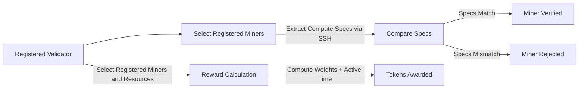

# Polaris Compute Subnet Validator (NetUID 33)

A cutting-edge tool for managing and verifying compute nodes on the Compute Subnet. The Polaris Validator ensures efficient onboarding of new miners and fair rewards distribution to active nodes/miners.

---

## Overview

The Polaris Compute Subnet Validator performs two primary functions:

1. **Verification of New Miners:** Ensures that miners pending verification meet the platform's requirements.
2. **Reward Mechanism:** Calculates and awards tokens to miners based on resource utilization and specifications.

---

## How It Works

### 1. **Verification**
- The validator checks if the miner is registered on Subnet 33.
- It establishes an SSH connection to the pending miner and extracts system specifications.
- Extracted specs are compared to the details provided during registration.
- Conditions for successful verification:
  - The miner remains active for 3-5 minutes during validation.
  - Registration to Subnet 33 is complete.
  - Matching specifications increase the likelihood of approval.

### 2. **Reward Mechanism**
- Only miners registered on Subnet 33 are considered.
- The validator calculates rewards based on:
  - Time containers are active.
  - System specifications (e.g., CPU and GPU weights).


Rewards = **Active Time (Containers)** + **Resource Weights**.
The (active time) considered is the time after the container has been utilized and marked pending payment
---

## Getting Started as a Validator

### 1. Install CommuneX

```bash
pip install communex
```

### 2. Create a Wallet

```bash
comx key create <key_name>
```

### 3. Register on Subnet 33

```bash
comx module register validator <key_name> 33
```

> **Note:** Registration requires burning 10 ComAI tokens.

---

## Installation and Setup

### Clone the Polaris Repository

```bash
git clone https://github.com/bigideainc/polaris-subnet.git
cd polaris-subnet
```

### Install Dependencies

Ensure Python 3.6 or higher is installed:

```bash
pip install -r requirements.txt
```

### Verify Installation

```bash
polaris --help
```

Example Output:

```
Usage: polaris [OPTIONS] COMMAND [ARGS]...

Polaris CLI - Modern Development Workspace Manager for Distributed Compute Resources

Options:
  --help  Show this message and exit.

Commands:
  check-main     Check if main process is running and view its logs.
  logs           View logs without process monitoring.
  register       Register a new miner.
  start          Start Polaris and Compute Subnet as background processes.
  status         Check if Polaris and Compute Subnet are running.
  stop           Stop Polaris and Compute Subnet background processes.
  update         Update various Polaris components.
  view-compute   View pod compute resources.
```

### Start Polaris Service

```bash
polaris start
```

Select Validator Node:

```bash
Enter choice [1-2]: 2
```

Initiate Validator Services:

```bash
python3 cli.py validator <key_name> --host <ip> --port <port>
```
Example: python3 polaris_subnet/cli.py validator yominer 127.0.0.1 8000
---

## Validation Process Flow



---

## License

This project is licensed under the [MIT License](LICENSE).

## Author

**Polaris Team**  
Contact: [fred@polariscloud.ai](mailto:fred@polariscloud.ai)

---

*For further assistance, reach out to the Polaris Team.*
